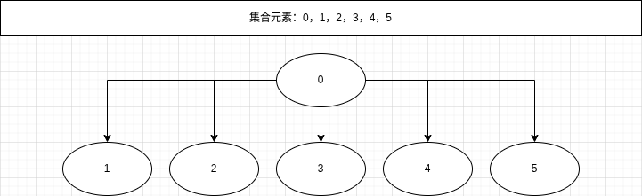

**结构：** 树

**特性：** 利用树可以快速查找（`Find`）与合并（`Union`）集合内的元素

# 示意图



> 树的根节点可以为*任意一个元素*

# 操作

> **参数解释**：
> 
> `a[i]`为集合内第i个元素
> 
> `p[i]`为第i个元素的父节点编号
> 
> `n`为集合长度

## 初始化 Init

默认每一个元素为一个集合

```cpp
void Init(int *a,int *p,int n){
    for(int i=1;i<=n;i++)
        p[a[i]]=a[i];
}
```

## 查找 Find

查找某个元素的根节点 *（采用递归）*

```cpp
int Find(int *p,int n){
    if(p[n]==n)
        return n;
    else return Find(p,p[n]);
}
```

## 合并 Union

合并两个并查集 *（森林合并）*

1. 查找两个数的根节点
   
   1. 如果相同 => 不合并
   
   2. 不相同 => 将一个树根节点的父节点改为另一个树的根节点

```cpp
void Union(int x,int y){
    int rootx=Find(x);
    int rooty=Find(y);
    if(x==y) return;
    p[rootx]=rooty;
}
```

# 完整代码+优化

## 完整代码（无优化）

```cpp
#include<bits/stdc++.h>
using namespace std;
int n;
int a[MAXN],p[MAXN];    //MAXN根据数据规模选定
void Init(){
    for(int i=1;i<=n;i++)
        p[a[i]]=a[i];
}
int Find(int x){
    if(p[x]==x)
        return x;
    else return Find(p[x]);
}
void Union(int x,int y){
    int rootx=Find(x);
    int rooty=Find(y);
    if(x==y) return ;
    else p[rootx]=rooty;
}
```

## 路径压缩+节点数量选择合并+空间压缩

节点数量在`p[]`中用负数表示

```cpp
#include<bits/stdc++.h>
using namespace std;
int n;
int a[MAXN],p[MAXN];    //MAXN根据数据规模选定
void Init(){
    for(int i=1;i<=n;i++)
        p[a[i]]=-1;        //-1为节点数量（空间压缩）
}
int Find(int x){
    if(p[x]<0)
        return x;
    else return p[x]=Find(p[x]);    //路径压缩
}
void Union(int x,int y){
    int rootx=Find(x);
    int rooty=Find(y);
    if(x==y) return ;
    else{                    //节点数量选择合并
        if(p[rootx]>p[rooty])
            p[rooty]=rootx;
        else if(p[rootx]<p[rooty])
            p[rootx]=rooty;
        else p[rootx]=rooty;
    }
}
```

## 并查集高度选择合并+空间压缩

并查集高度在`p[]`中用负数表示

```cpp
#include<bits/stdc++.h>
using namespace std;
int n;
int a[MAXN],p[MAXN];    //MAXN根据数据规模选定
void Init(){
    for(int i=1;i<=n;i++)
        p[a[i]]=-1;        //-1为并查集高度（空间压缩）
}
int Find(int x){
    if(p[x]==x)
        return x;
    else return Find(p[x]);
}
void Union(int x,int y){
    int rootx=Find(x);
    int rooty=Find(y);
    if(x==y) return ;
    else{                    //并查集高度选择合并
        if(p[rootx]>p[rooty])
            p[rooty]=rootx;
        else if(p[rootx]<p[rooty])
            p[rootx]=rooty;
        else p[rootx]=rooty;
    }
}
```
