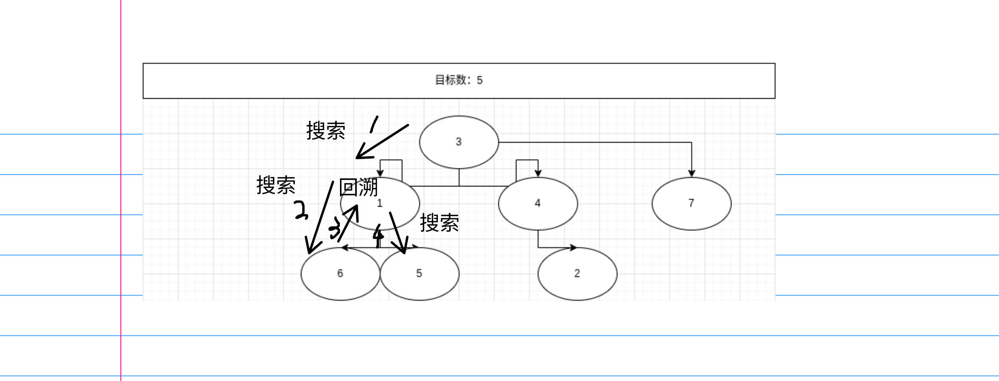

**思想：** 通过递归枚举每一个元素（情况），*深度优先搜素*

# 示意图



# 代码

```cpp
//第一种
func search(k){
    for(i=初始值;i未达到算符种数;i更新)
        if(满足条件){
            保存结果;
            if(搜索到了) 输出;
            else search(往下一层);
            取消保存结果;
        }
}
//第二种
func search(k){
    if(搜索到了) 输出;
    else 
        for(i=初始值;i未达到算符种数;i更新)
            if(满足条件){
                保存结果;
                search(往下一层);
                取消保存结果;
            }
}
```

# 
